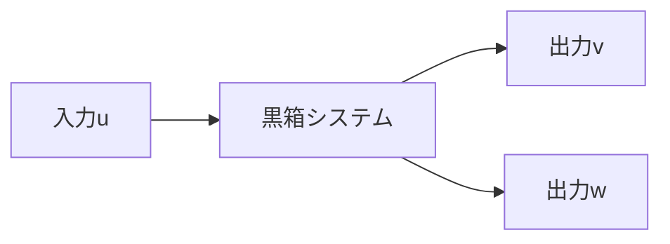

---
tags:
  - 数学
  - 例题
---
## 問題3
### 問2
考虑一个有1个输入和2个输出的系统。

已知得到了$N$组输入输出数据$\{(u_i, v_i, w_i) | i = 1, 2, ..., N\}$。使用这些数据来通过最小二乗法拟合以下两个回归模型：
$$ v = au + a + b $$
$$ w = au^2 - 2au + a + b $$

#### (1)
求解 $v$ 的残差二乗和 $E_v$ 和 $w$ 的残差二乗和 $E_w$。
#### (2)
求使得 $E = E_v + E_w$ 最小的参数 $a$ 和 $b$。通过解决一个系统方程来找到最优的 $a$ 和 $b$。系统中已经定义了参数 $\alpha$, $\beta$, $\gamma$, $\xi$, $\eta$ 来表达某些和 $u$、$v$、$w$ 相关的累加或累乘项。给定条件 $\alpha\beta - \gamma^2 \neq 0$，确保系统方程有解。

#### 方程定义

对于求解 $a$ 和 $b$，需要构建并解决以下形式的线性方程组：
$$
\begin{bmatrix}
\alpha & \gamma \\
\gamma & \xi
\end{bmatrix}
\begin{bmatrix}
a \\
b
\end{bmatrix}
=
\begin{bmatrix}
s \\
n
\end{bmatrix}
$$

#### 参数计算

- $\alpha = \sum_{i=1}^N u_i^2$
- $\beta = \sum_{i=1}^N u_i$
- $\gamma = \sum_{i=1}^N u_i^3$
- $\xi = \sum_{i=1}^N u_i^4$
- $\eta = N$

这些参数将帮助我们通过公式化的方式找到使得总残差$E$最小的$a$和$b$。

### 步骤与解析

首先，定义好残差公式，其次，通过偏导数将残差二乗和关于$a$和$b$的表达式导出并设置为零，以构建上述方程组。然后，通过已给出的公式计算$\alpha, \beta, \gamma, \xi, \eta$等参数，最后解方程找到$a$和$b$的值。