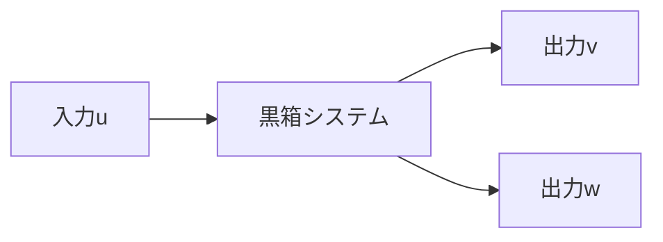

---
tags:
  - 数学
  - 例题
---
## 問題1
### 問1
3次元空間に直交座標系 $O-xyz$ をとる。 $x^2 + y^2\leq 1$, $0\leq z \leq 1$ で定められる 領域$V$の表面を$S$とする。 ベクトル場$A$が$A= (x,y,0)$で与えられる場合に次式の$S$上における法線面積分$I_A$を計算せよ。 
$$I_A=\int_S A\cdot dS$$
ただし，面積要素ベクトル$dS$は領域$V$の外向きを正とする。

## 問題3
### 問2
考虑一个有1个输入和2个输出的系统。

已知得到了$N$组输入输出数据$\{(u_i, v_i, w_i) | i = 1, 2, ..., N\}$。使用这些数据来通过最小二乗法拟合以下两个回归模型：
$$ v = au + a + b $$
$$ w = au^2 - 2au + a + b $$
#### (1)
求解 $v$ 的残差二乗和 $E_v$ 和 $w$ 的残差二乗和 $E_w$。
#### (2)
求使得 $E = E_v + E_w$ 最小的参数 $a$ 和 $b$。通过解决一个系统方程来找到最优的 $a$ 和 $b$。系统中已经定义了参数 $\alpha$, $\beta$, $\gamma$, $\xi$, $\eta$ 来表达某些和 $u$、$v$、$w$ 相关的累加或累乘项。给定条件 $\alpha\beta - \gamma^2 \neq 0$，确保系统方程有解。

