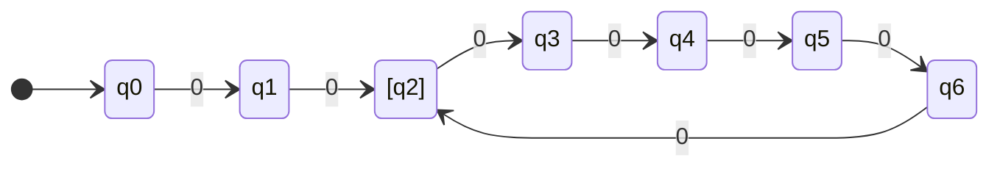

---
tags:
  - 例题
  - 過去問
dlink:
  - "[[九州大学]]"
datetime: 2024-12-10 01:56:45
---
# 数学

## 線形代数
n次元ユークリッド空間上の $n + 1$ 個の点 $p_1, p_2, \dots, p_{n+1} \in \mathbb{R}^n$ に対し, 2点 $p_i, p_j$ 間のユークリッド距離を $d_{i,j} = \|p_i - p_j\|$ で表す．ただし, 各 $p_i$ は列ベクトルである．また, $g_{i,j} = d_{i,n+1}^2 + d_{j,n+1}^2 - d_{i,j}^2 \ (1 \leq i, j \leq n)$ を添字順に並べて得られる行列を $G = (g_{i,j}) \in \mathbb{R}^{n \times n}$ とする．このとき以下の各問いに答えよ. 

1. $n = 2$ とする．以下の2つの場合に対して, 等式条件を満たす3個の点 $p_1, p_2, p_3 \in \mathbb{R}^2$ の組をそれぞれ1つ求めよ. 
   - (a) $(d_{1,2}, d_{1,3}, d_{2,3}) = (1, 1, 1)$
   - (b) $(d_{1,2}, d_{1,3}, d_{2,3}) = (1, 2, 3)$

2. $x_j = p_j - p_{n+1} \ (1 \leq j \leq n)$ とし, $x_j$ を添字順に並べて得られる行列を $X = (x_j) \in \mathbb{R}^{n \times n}$ とする．(1) で求めた答えに対し, $X^\top X$ をそれぞれ計算せよ. 

3. 一般に $G$ が半正定値であることを示せ．ただし, $n \times n$ 実対称行列 $A \in \mathbb{R}^{n \times n}$ が半正定値であるとは, 任意のベクトル $v \in \mathbb{R}^n$ に対して $v^\top A v \geq 0$ が成り立つことをいう. 

---

## 解析学・微積分

1. $R^m$ 上で微分可能な実数値関数 $f(x) \ (x = (x_1, x_2, \dots, x_m))$ について, $x_i = v_i(t) \ (i = 1, 2, \dots, m)$ とおく．ただし, 各 $v_i$ は $R$ 上で微分可能な関数とする．次の各問いに答えよ. 
   - (a) $\frac{df}{dt}$ を $\frac{\partial f}{\partial x_i}$ と $\frac{dv_i}{dt} \ (i = 1, 2, \dots, m)$ で表せ. 
   - (b) $m = 2, f(x) = x_1^2 + x_1 x_2 + 2x_2^2, v_1(t) = \sin t, v_2(t) = e^t$ のとき, $\frac{df}{dt}$ を求めよ. 

2. 次の微分方程式の一般解を求めよ. $$\frac{dy}{dx} - 2xy = e^{x^2}$$

3. 閉曲線 $C$ に沿った複素積分   $$\oint_C \frac{\cos z}{(2z - \pi)^3} \, dz$$
   を求めよ．ただし, $C$ は円 $|z| = 2$ とする. 

---
## ベクトル解析

直交座標系において, $x$, $y$, $z$ 軸方向の単位ベクトルをそれぞれ $\mathbf{i}$, $\mathbf{j}$, $\mathbf{k}$ とする．ベクトル場 $\mathbf{F}$ を
$$
\mathbf{F} = x\mathbf{i} + 2y\mathbf{j} + 10z\mathbf{k}
$$
とする．次の面 $S_1, S_2$ および $S_3$ に対する面積分を計算せよ. 

1. $S_1$ を円筒面 $x^2 + z^2 = 1 \ (0 \leq y \leq 4)$ とする (上面と底面の無い円筒の表面) ．円筒外向き法線ベクトルを用いよ. 

2. $S_2$ を円筒面の一部 $x^2 + z^2 = 1 \ (0 \leq y \leq 4, 0 \leq z)$ と長方形面 $z = 0 \ (-1 \leq x \leq 1, 0 \leq y \leq 4)$ からなる半円筒面とする (上面と底面の無い半円筒の表面) ．半円筒外向き法線ベクトルを用いよ. 

3. $S_3$ を円筒面 $x^2 + z^2 = 1$ と, 平面 $z = 0, y = 0, x + y = 4$ で囲まれた領域の境界とする．外向き法線ベクトルを用いよ. 

---
## 確率・統計

2以上の自然数 $n$ に対して, $P = (P_1, \dots, P_n)$ は一様ランダムに選ばれた $\{1, \dots, n\}$ の順列とする．任意の自然数 $i, j \ (1 \leq i < j \leq n)$ に対して, 
$$
X_{ij} =
\begin{cases} 
1 & (P_i > P_j \text{の場合}) \\
0 & (\text{それ以外})
\end{cases}
$$
また, $Y_i = \sum_{j=i+1}^n X_{ij} \ (1 \leq i \leq n-1)$ とし, $Z = \sum_{i=1}^{n-1} Y_i$ とする．以下の各問いに答えよ. 

1. $Z$ の期待値 $E[Z]$ を求めよ. 

2. $i \ (1 \leq i \leq n-2)$ と $k \ (0 \leq k \leq n-i)$ に対して, $Y_{n-1} = l \ (l \in \{0, 1\})$ の条件の下で $Y_i = k$ となる条件付確率 $P[Y_i = k | Y_{n-1} = l]$ を求めよ. 

3. $Z$ の分散 $\mathrm{Var}[Z]$ を求めよ. ただし, 
$$
\sum_{k=1}^n k^2 = \frac{1}{6}n(n+1)(2n+1)
$$
を用いて良い. 

---
# 选修
## 情報理論

### 問1 
$k$ を正の整数とする．入力アルファベットが $X = \{0, 1\}^k$, 出力アルファベットが $Y = \{0, 1\}^k$ の無記憶な通信路 $W(Y|X)$ を
$$
W(Y|X) =
\begin{cases}
0 & (d(X, Y) = 0) \\
\frac{1}{k} & (d(X, Y) = 1) \\
0 & (d(X, Y) \geq 2)
\end{cases}
$$
で定める．ただし, $d(X, Y)$ は, $X = (X_1, X_2, \dots, X_k)$ と $Y = (Y_1, Y_2, \dots, Y_k)$ の間のハミング距離
$$
d(X, Y) = \sum_{i=1}^k |X_i - Y_i|
$$
を表す．この通信路の通信路容量を求めよ．

### 中文翻译
设 $k$ 为正整数. 输入字母表为 $X = \{0, 1\}^k$, 输出字母表为 $Y = \{0, 1\}^k$, 定义如下的无记忆信道 $W(Y|X)$: 
$$
W(Y|X) =
\begin{cases}
0 & (d(X, Y) = 0) \\
\frac{1}{k} & (d(X, Y) = 1) \\
0 & (d(X, Y) \geq 2)
\end{cases}
$$
其中 $d(X, Y)$ 表示 $X = (X_1, X_2, \dots, X_k)$ 和 $Y = (Y_1, Y_2, \dots, Y_k)$ 之间的汉明距离: 
$$
d(X, Y) = \sum_{i=1}^k |X_i - Y_i|
$$
求此信道的通信容量. 

---
### 問2 
アルファベットが $\{1, 2, 3, 4\}$ である単純マルコフ情報源の遷移確率行列が
$$
\begin{pmatrix}
0.5 & 0.5 & 0 & 0 \\
0 & 0.5 & 0.5 & 0 \\
0 & 0 & 0.5 & 0.5 \\
0.5 & 0 & 0 & 1-\gamma
\end{pmatrix}
$$
で与えられたとする．ここで, $(i, j)$ 成分は遷移確率 $P(j|i)$ を表し, $0 < \gamma < 1$ とする．以下の問いに答えよ: 

1. このマルコフ情報源の状態遷移図を図示せよ．
2. このマルコフ情報源の定常確率分布が $(1/8, 1/4, 1/8, 1/2)$ であるとき, $\gamma$ の値を求めよ．
3. (2) が前問で求めた値となるとき、このマルコフ情報源のエントロピー率を求めよ．
4. このマルコフ情報源に従う確率変数の列 $X_1, X_2, \dots$ を考える．$X_i$ が上述の定常確率分布 $(1/8, 1/4, 1/8, 1/2)$ に従う場合, $(X_1, X_2)$ に対するハフマン符号化を行い, 符号的表示图を示せ．ただし符号語のアルファベットは $\{0, 1\}$ とする．
### 中文翻译
给定字母表为 $\{1, 2, 3, 4\}$ 的简单马尔可夫信息源, 其状态转移概率矩阵如下: 
$$
\begin{pmatrix}
0.5 & 0.5 & 0 & 0 \\
0 & 0.5 & 0.5 & 0 \\
0 & 0 & 0.5 & 0.5 \\
0.5 & 0 & 0 & 1-\gamma
\end{pmatrix}
$$
其中 $(i, j)$ 元素表示状态 $i$ 转移到状态 $j$ 的概率 $P(j|i)$, $0 < \gamma < 1$. 

1. 绘制该马尔可夫信息源的状态转移图. 
2. 假设该马尔可夫信息源的平稳分布为 $(1/8, 1/4, 1/8, 1/2)$, 求 $\gamma$ 的值. 
3. 在 $\gamma$ 为前述求得的值时, 计算该马尔可夫信息源的熵率. 
4. 假设符号序列 $X_1, X_2, \dots$ 服从平稳分布 $(1/8, 1/4, 1/8, 1/2)$, 为 $(X_1, X_2)$ 执行哈夫曼编码, 并绘制编码结果的图. 假设编码字母表为 $\{0, 1\}$. 

---
## オートマトンと言語
### 問1 
以下の状態遷移図を持つ決定性有限オートマトンを $M = (K, \Sigma, \delta, q_0, F)$ とする. 
- $K = \{q_0, q_1, \dots, q_6\}$, 状態集合
- $\Sigma = \{0\}$,
- $\delta: K\times\Sigma\to K$は遷移関数
- $q_0$ は初期状態,
- $F = \{q_2\}$ は最終状態集合.

このオートマトン M に基づいて、決定性有限オートマトン $\tilde{M} = (\tilde{K}, \tilde{\Sigma}, \tilde{\delta}, \tilde{q_0}, \tilde{F})$ を、
$$\tilde{K} = K \times K, \ \tilde{\Sigma} = \{0, 1\}, \ \tilde{q_0} = (q_0, q_0), \ \tilde{F} = \{(q_2, q_2)\},$$
$$\tilde{\delta}((q, q'), a) =
\begin{cases}
(\delta(q, 0), \delta(q', 0)) & a = 0 のとき, \\
(\delta(q, 1), \delta(q', 1)) & a = 1 のとき
\end{cases}$$
と定義する。入力文字列 $10$ に対するオートマトン $\tilde{M}$ の状態系列は
$$(q_0, q_0) \to (q_1, q_2) \to (q_2, q_3),$$
遷移先状態はその最後の状態 $(q_2, q_3)$ であることに注意せよ。以下の各問いに答えよ。

1. 入力文字列 $01101$ に対するオートマトン $\tilde{M}$ の状態系列を記せ。
2. $n (≥ 1)$ が $5$ の倍数のとき、入力文字列 $1^n$ に対するオートマトン $\tilde{M}$ の遷移先状態が $(q_5, q_5)$ となることを示せ。
3. 長さ $2$ 以上の入力文字列 $w ∈ \{0, 1\}^*$ に対するオートマトン $\tilde{M}$ の遷移先状態を $(q_{iw}, q_{jw})$ とする。$iw, jw ∈ \{2, 3, 4, 5, 6\}$ を、$\#_0(w), \#_1(w)$ を用いた式で表せ。ただし、$\#_a(w)$ は文字列 $w$ に現れる文字 $a$ の個数を表す。
4. オートマトン $\tilde{M}$ が受理する言語は
$$
\{w \in \{0, 1\}^* | \#_0(w) \mod 5 = 2, \#_1(w) \mod 5 = 0\}
$$
	であることを示せ。ただし、$x \mod y$ は $x$ を $y$ で割ったときの余りを表す。

### 中文翻译
定义以下状态转移图的确定性有限自动机 $M = (K, \Sigma, \delta, q_0, F)$：
- $K = \{q_0, q_1, \dots, q_6\}$，状态集合
- $\Sigma = \{0\}$，输入字母表
- $\delta: K \times \Sigma \to K$ 为状态转移函数
- $q_0$ 是初始状态
- $F = \{q_2\}$ 是终态集合

基于此自动机 $M$，定义确定性有限自动机 $\tilde{M} = (\tilde{K}, \tilde{\Sigma}, \tilde{\delta}, \tilde{q_0}, \tilde{F})$，如下：
$$\tilde{K} = K \times K, \ \tilde{\Sigma} = \{0, 1\}, \ \tilde{q_0} = (q_0, q_0), \ \tilde{F} = \{(q_2, q_2)\},$$
$$\tilde{\delta}((q, q'), a) =
\begin{cases}
(\delta(q, 0), \delta(q', 0)) & a = 0 \text{ 时}, \\
(\delta(q, 1), \delta(q', 1)) & a = 1 \text{ 时}
\end{cases}$$
对于输入字符串 $10$，自动机 $\tilde{M}$ 的状态序列为：
$$(q_0, q_0) \to (q_1, q_2) \to (q_2, q_3),$$
最终状态为 $(q_2, q_3)$。回答以下问题：

1. 给出输入字符串 $01101$ 在自动机 $\tilde{M}$ 上的状态序列。
2. 证明当 $n (≥ 1)$ 是 $5$ 的倍数时，输入字符串 $1^n$ 在自动机 $\tilde{M}$ 上的最终状态为 $(q_5, q_5)$。
3. 对于长度 $≥ 2$ 的字符串 $w ∈ \{0, 1\}^*$，自动机 $\tilde{M}$ 的最终状态记为 $(q_{iw}, q_{jw})$，其中 $iw, jw ∈ \{2, 3, 4, 5, 6\}$。请用字符串 $w$ 中 $0$ 和 $1$ 的个数（即 $\#_0(w)$ 和 $\#_1(w)$）表示 $iw$ 和 $jw$。
4. 证明自动机 $\tilde{M}$ 接受的语言是：
$$
\{w \in \{0, 1\}^* | \#_0(w) \mod 5 = 2, \#_1(w) \mod 5 = 0\}
$$
其中 $x \mod y$ 表示 $x$ 除以 $y$ 的余数。

---
### 問2 
文字列 $x$ と文字列 $y$ に対して, $\#_y(x)$ を $x$ における $y$ の部分文字列としての出現回数とする．例えば、文字列$x=abbbabb$と文字列$y=bb$について、$\#_y(x)=3$である. また、文字列$x$の反転文字列を$x^R$と表す. 以下の言語を考える: 
$$
\begin{align}
&L_1 = \{x ∈ \{a, b\}^* | \#_a(x) = \#_b(x)\}, \\
&L_2 = \{x ∈ \{a, b\}^* | \#_{ab}(x) = \#_{ba}(x)\}, \\
&L_3 = \{x ∈ \{a, b\}^* | \#_{aa}(x) = \#_{bb}(x) = 0\}, \\
&L_4 = \{xx^R | x ∈ \{a, b\}^*\}, \\
&L_5 = \{a^i b^j c^k | i, j, k ≥ 0, j = i + k\}.
\end{align}
$$
言語 $L_1, L_2, L_3, L_4, L_5$ のそれぞれについて: 
- 正則であれば正規表現を与えよ. 
- 正則でなければ文脈自由文法を与えよ. 

### 问题2: 语言和文法
设 $\#_y(x)$ 表示字符串 $x$ 中子字符串 $y$ 出现的次数. 例如, $\#_y(x)=3$ 表示字符串 $x=abbbabb$ 和 $y=bb$.  字符串 $x$ 的反转字符串用 $x^R$ 表示. 考虑以下语言: 
$$
\begin{align}
&L_1 = \{x ∈ \{a, b\}^* | \#_a(x) = \#_b(x)\}, \\
&L_2 = \{x ∈ \{a, b\}^* | \#_{ab}(x) = \#_{ba}(x)\}, \\
&L_3 = \{x ∈ \{a, b\}^* | \#_{aa}(x) = \#_{bb}(x) = 0\}, \\
&L_4 = \{xx^R | x ∈ \{a, b\}^*\}, \\
&L_5 = \{a^i b^j c^k | i, j, k ≥ 0, j = i + k\}.
\end{align}
$$

对语言 $L_1, L_2, L_3, L_4, L_5$: 
- 如果是正则语言, 请给出正则表达式. 
- 如果不是正则语言, 请给出生成它的文法. 